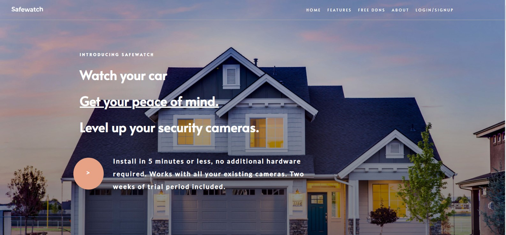

# react-landing-page-clone

This React application is the attempt to clone selected sections of the [Safewatch landing page](https://usesafewatch.com/).

The following library has been used:

[@emotion/core](https://www.npmjs.com/package/@emotion/core)

## CodeSandbox

[Find the project on CodeSandbox](https://codesandbox.io/s/ecstatic-sea-7ykdv)

## To Do

- [ ] Finish cloning the page.

## How to start

Please run `yarn start` to start the application
